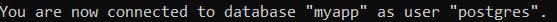
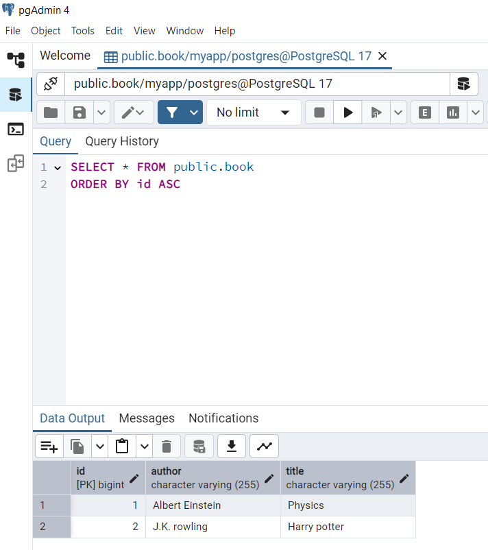
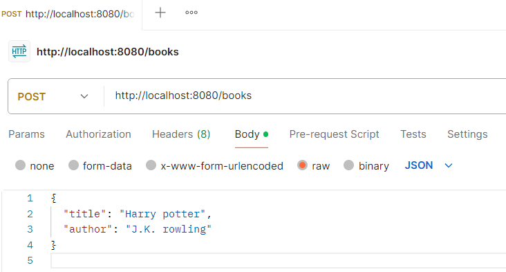

#  Book Management API

This project is a simple REST API built with Java, Spring Boot, JPA, and PostgreSQL.


---

## Features

- Create, read, update, and delete books
- RESTful endpoints with Spring Boot
- Data persistence using Spring Data JPA and PostgreSQL
- Tested using Postman and cURL
- Managed with Maven in IntelliJ IDEA

---

## Technologies Used

- Java 24
- Spring Boot 3.2.5
  - Spring Web
  - Spring Data JPA
- PostgreSQL
- Maven
- IntelliJ IDEA
- Postman
- cURL
- pgAdmin
- SQL Shell (psql)

---

## Configuration

The database configuration is handled via the `application.properties` file located in:

```

src/main/resources/application.properties

````

This file contains the PostgreSQL database connection and JPA settings. Update the credentials as needed.

---

## How to Run

1. **Clone the repo**  
   ```bash
   git clone https://github.com/m-nasereslami/book-api-springboot.git
   cd book-api-springboot
   ```

2. **Configure PostgreSQL**
   Create the database manually using SQL Shell or pgAdmin:

   ```sql
   CREATE DATABASE myapp;
   ```

3. **Build and run the app**

   ```bash
   mvn spring-boot:run
   ```

4. **API Endpoints**

| Method | Endpoint      | Description       |
| ------ | ------------- | ----------------- |
| GET    | `/books`      | Get all books     |
| POST   | `/books`      | Create a new book |
| PUT    | `/books/{id}` | Update a book     |
| DELETE | `/books/{id}` | Delete a book     |

---

## Folder Structure

```
book-api-springboot/
├── pom.xml
├── src/
│   └── main/
│       ├── java/
│       │   └── org/
│       │       └── example/
│       │           ├── Application.java
│       │           ├── Book.java
│       │           ├── BookController.java
│       │           └── BookRepository.java
│       └── resources/
│           └── application.properties
```

---

## Usage Examples

### 1. SQL Shell (psql) – Creating the Database

```sql
CREATE DATABASE myapp;
```



### 2. pgAdmin – Viewing Tables
<div style="text-align: center;">

</div>

### 3. Postman – Test API Calls
<div style="text-align: center;">

</div>


### 4. Command Prompt – Running the App

```bash
mvn spring-boot:run
```


### 5. cURL – Command-line API Usage

```bash
curl -X POST http://localhost:8080/books \
-H "Content-Type: application/json" \
-d "{\"title\":\"1984\", \"author\":\"George Orwell\"}"
```


